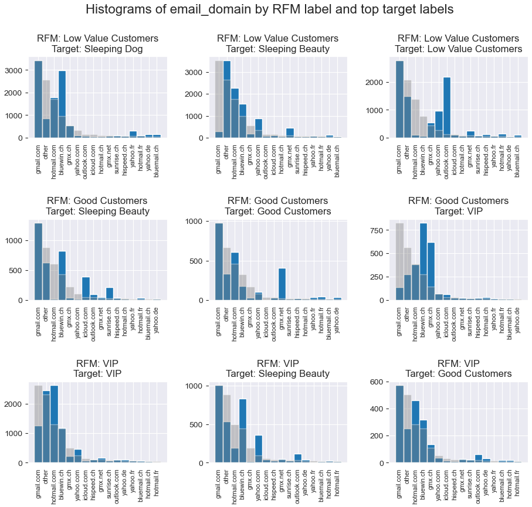

# CRM Predictions

Welcome to the repository for my capstone project in the program __Applied Data Science: Machine Learning__ at the [EPFL Extension School](https://www.extensionschool.ch/learn/applied-data-science-machine-learning).

# Guide to the Notebooks

This guide provides a brief overview of each notebook and its purpose within the project. The notebooks are organized as follows:

1. **01_Dataset-Creation.ipynb**: Creates the dataset from extracted databases.
2. **02_Additional-EDA.ipynb**: Performs additional Exploratory Data Analysis (EDA) after the initial proposal and initial EDA. All notebooks related to the proposal and initial EDA can be found in the `Proposal Notebooks` folder.

3. `03_RandomForest.ipynb`, `04_LogisticRegression.ipynb`, `05_k-NN.ipynb`, `06_Neural network.ipynb`, `07_MLPClassifier.ipynb`, `08_XGBoost.ipynb` : These notebooks focus on the fine-tuning of each model, with the notebook names indicating the model being fine-tuned.

4. **09_Conclusions.ipynb**: Summarizes the results from all models. The notebook provides a concise view of the results without code for plots. These results can be found in Section IV: [Conclusions](#conclusions).

# Table of Contents

I. [Data Preparation](#data_preparation)
   1. [Introduction](#introduction)
      a. [Problem formulation](#problem_formulation)
      b. [What is RFM](#what-is-rfm)
   2. [Data Collection](#data_collection)
      a. [Data loading](#data_loading)
      b. [Dataset creation](#dataset_creation)
   3. [Data Processing](#data_processing)
      a. [Handling Missing Values](#missing_values)
      b. [Feature engineering](#feature_engineering)

II. [Exploratory Data Analysis (EDA)](#eda)
   1. [Descriptive statistics](#descriptive_stats)
      a. [Preliminary EDA](#descriptive_stats_preliminary_eda)
      b. [Additional EDA](#descriptive_stats_additional_eda)
   2. [Dimensionality reduction with PCA](#pca)
   3. [Insights, challenges](#insights)

III. [Machine Learning](#machinelearning)
   1. [Initial Plan](#ml_initial_plan)
   2. [Models evaluation](#ml_model_evaluation)
   3. [Methodologies](#ml_methodologies)
   4. [Methods used across models](#ml_methods)
      a. [Outliers exclusion](#ml_outliers)
      b. [Scaling of features](#ml_scaling)
      c. [Dimensionality Reduction](#ml_dimensionality)
   5. [Model tuning](#ml_models_tuning)
      a. [Random Forest](#ml_rf)
      b. [Logistic Regression](#ml_logreg)
      c. [K-Nearest Neighbors (KNN) classifier](#ml_knn)
      d. [Neural network](#ml_neuralnetwork)
      e. [XGBoost](#ml_xgboost)
      f. [MLPClassifier](#ml_mlp)

IV. [Conclusions](#conclusions)
   1. [Chosen model parameters](#chosen-parameters)
   2. [Model Results](#model_results)
      a. [Overall scores](#overall_scores)
      b. [Random Samples](#randomsamples)
   3. [Permutation importance](#permutation_importance)
      a. [Top Features](#top_features)
      b. [Bottom Features](#bottom_features)
   4. [Error Analysis](#error_analysis)
      a. [Correlations](#correlations)
      b. [Distribution](#distribution)
  5. [Chosen Classifier](#chosen-classifier)
  6. [Final words](#final_words)

<a name="data_preparation"></a>

# Data Preparation

<a name="introduction"></a>

## Introduction

<a name="problem_formulation"></a>

### Problem formulation

General problem formulation
- Our goal is knowing how well we can predict future customer class based on today's information

Machine learning formulation
- The intended outcome is to build a __predictive model that can accurately predict future customer classes based on the current information available about the customers__. This is a __multiclass classification__ problem on __tabular data__, where the goal is to assign each customer to one of the predefined classes. 

- One important consideration is to find the right balance between model complexity and generalization. While it is desirable to achieve high precision and recall on the training data, __it is essential for the model to generalize well outside the training data__ to perform well on new, unseen data. The main objective of the project is to enable informed decisions based on the predicted customer classes, helping marketing efforts.

<a name="what-is-rfm"></a>

### What is RFM

Customer relationship management (CRM) programs need to identify and leverage differences across customers to be successful. This becomes difficult especially with new customers, as they have only made one purchase and lack repeated observations.

The goal is to understand what drives differences across recently acquired customers and what characteristics may reflect underlying preferences and attitudes. For this, one of the methodology is to use RFM segmentation

**What is RFM segmentation ?** RFM analysis is a customer segmentation technique that stands for **Recency, Frequency, and Monetary**. These are indicators of customer behavior, each one reflects a different aspect of customer engagement.

- **Recency** refers to the amount of time since a customer's last purchase, and is a key factor in determining their level of engagement. Customers who have made a purchase more recently are more likely to be retained, while those who have not made a purchase in a long time may be at risk of churning. 
> Here our recency indicator is `days_since_last_order`

- **Frequency** measures how often a customer makes a purchase. Customers who purchase frequently are generally more satisfied and engaged.
> Frequency indicator is number of orders in last 2 years `orders_24m`.

- **Monetary** reflects the amount of money that a customer has spent with the business. This metric is important because it helps to differentiate high-value customers from low-value ones.
> Monetary indicator is amount of orders in last 2 years `order_amount_24m`.

Our RFM Segmentation splits database in the following segments


The quality of RFM segmentation presented above is not its mathematical perfection, but the fact it comes from pre existing norms used by Management. In fact, one of the important factor to take into consideration when building RFM is industry recency norms for instance (how frequent should a customer buy a product, not the same answer for a car or a tomato).

To rephrase, the main advantage of RFM is readability across the organization and we will try to make predictions on RFM label, knowing that there might be better statistical methods to assign labels.

<a name="data_collection"></a>

## Data Collection

<a name="data_loading"></a>

### Data loading

CSV are generated in Google Cloud Plaftorm where anonymization is performed
- Amount for order_amount and item_amount are mutliplied by a hidden factor
- All product names, product franchise, customerID, orderIDs, itemIDs are hashed using SHA256 in GCP

> The detail of SQL queries is in SQL Queries.ipynb

<a name="dataset_creation"></a>

### Dataset creation

Notebook `01_Dataset-Creation.ipynb` processes and analyzes customer data from multiple sources, including contact information, orders, and email behavior. It calculates various KPIs and generates a snapshot of customer behavior at different time intervals based on a specified end date. Here is a summary of what each section does


- **Creating Calculated KPIs**
  - **Orders statistics**: Various order statistics for each customer in different time frames. Example: Total number of orders, total order amount, dates of first and last orders, orders within the last 15 days, 1 month, 3 months, etc.
  - **Time-intervals**: Days between certain dates. Example: days between the customer's last order date and the specified end_date (used for Recency in RFM segmentation)
  - **Promo intensity, purchase channels**: Determines promo rates and preferred channels of purchase for each customer
  - **Item diversity, item categories**
  - **Average amounts**: Mean and standard deviation of order amounts, mode of order time, and mean of order weekday
  - **Email behavior**: Preferred devices for opening and clicking emails. Overall email clicks and opens.

- **Generating backdated databases**: 
  - Creates snapshots of the customer database at different time intervals.

- **Adding Target Labels**: 
  - Adds RFM labels as target labels for future dates (3, 6, 9, and 12 months after the snapshot date) to each database snapshot.

- **Stacking Database Snapshots**: 
  - Combines all snapshots into a single DataFrame to increase training data and includes a `generation_month` column to account for potential seasonality effects on future RFM labels.

- **Keeping only VIP, Good Customers, and Low Value Customers**: 
  - Retains only three RFM labels: VIP, Good Customers, and Low Value Customers, while removing 'Mono Customer' label as a potential target label since it creates too much of a class imbalance.
  - Reasons for focusing on these three RFM labels:
    1. They have fewer missing values in features, leading to more complete data.
    2. Other classes have high dummy predictor accuracy, making them less interesting for analysis.
    3. VIP, Good Customers, and Low Value Customers are adjacent in the RFM segmentation.

- **Getting a Random Sample**: 
    - We obtain a random sample while __maintaining equal proportions in target labels__ to address the class imbalance issue.

<a name="data_processing"></a>

## Data Processing

We now process and prepare our sample for machine learning models.

<a name="missing_values"></a>

### Handling Missing Values

1. **Dates**:
   - Drop redundant date columns.
   - Calculate the age of customers based on their `birthdate` and drop the `birthdate` column.

2. **CustomerID**:
   - Remove the `customer_id` and `generation_date` columns.
   - Keep `generation_month` as a potentially relevant time feature to capture seasonal trends.

3. **Promo rates**: Standardize promotional rates to a range between 0 and 1.

4. **Orders related**: Handle missing values on orders by replacing them with 0.

5. **Age**: Replace missing values in the `age` column with the mean for the corresponding `gender`, `recruitment_source`, and `rfm_label` categories.

6. **Devices**: Replace 'nan', 'unknown', 'proxy', and 'Other' values in the `preferred_device_open` and `preferred_device_click` columns using the most frequent device value for each email domain and `rfm_label` combination.

7. **Colinear Columns**: 
   - Remove highly correlated columns.
   - Add a new feature: the average number of days between orders.
   - Keep the `days_since_first_order` column.
   - Remove columns used solely for RFM calculation, split some features into separate, non-overlapping features.
   - Remove `average_order_promo_rate`, keep `orders_with_promo_rate`.

<a name="feature_engineering"></a>

### Feature engineering

We apply the same logic for categorical columns, converting them to ordinal features by averaging the values driving better customer classes, using this class_map

```python
class_map = {
  'Sleeping Dog': 0,
  'Sleeping Beauty': 1,
  'Low Value Customers': 2,
  'Good Customers': 3,
  'VIP': 4
  }
```

1. **Gender / Language**: Transform `gender` and `language` features into ordinal features, and assess customer profiles based on their combinations.
2. **Email info**: Create a new feature called `email_behavior_rating` by concatenating `preferred_device_open` and `preferred_device_click` columns, and apply a similar approach to the `email_domain` feature.

3. **Numerical Features**:
   - **Density**: Create two features indexed by zip_code:
     - Percentage of foreigners living in each postal code.
     - Population density in each postal code.

4. **Normality**:
   - Apply log or sqrt transformations to features to reduce skewness and improve normality.


<a name="eda"></a>

# Exploratory Data Analysis (EDA)

<a name="descriptive_stats"></a>

## Descriptive Statistics:

<a name="descriptive_stats_preliminary_eda"></a>

### Preliminary EDA

Here are our findings from preliminary EDA

  - **Differentiating features:** Total orders and total orders amount.
  - **Non-differentiating features:** Avg order value, order standard deviation, order promo rates, days since acquisition, diversity measures, and email clicks.
  - **Order patterns:** Most orders occur during the week and working hours; VIP and Good Customers focus purchases on Thursday afternoons.


  - **Email domains:** Swiss domains overrepresented on Good Customers; French/German/Italian email domains overrepresented on Sleeping Dog and MonoCustomers; Yahoo.com unclear.



**Features and their relationship with the target:**
  - **Visually useful:** Order amount in the last two years, days since last order, average days between orders.


<a name="descriptive_stats_additional_eda"></a>

### Additional EDA

- Newly created features such as percentage of foreigners living in each postal code does not visually identify clusters

- Pairplot was used to investigate potential relationships or clusters between features; however, it was difficult to identify such relationships or clusters using this method. Here is pairplot on top correlated features with target labels.


No linear relationships found between features, suggesting that more sophisticated modeling techniques may be needed to effectively capture the underlying patterns in the data.

<a name="pca"></a>

## PCA

PCA is a common technique for dimensionality reduction that can help us identify which features are most important in explaining the variance in our data. By using PCA, we can transform our high-dimensional feature space into a lower-dimensional space while still retaining much of the original variance in the data.


We also applied the K-means clustering algorithm with 5 clusters to our data, but the resulting clusters did not match the distribution of our actual classes. This is in line with our earlier finding that there are no clear linear relationships between our features.


<a name="insights"></a>

##  Insights, challenges

**What is our approach ?**
- Fit multiple machine learning models, including models that generalize well outside training data (e.g., neural networks, logistic regression) and models that may not (e.g., random forest, K-neighbors classifiers).

**Challenges identified:**
1. **Dealing with tabular data:** No option to use transfer learning with pretrained models as this is not audio or video data, and patterns in this customer data are not generalizable to all customer data (buying patterns are industry specific).
2. **Lack of linear relationships:** There do not seem to be linear relationships between the target label and features, which will make it difficult to fit a classifier that can model more complex relationships.
3. **PCA insights:** PCA can explain 90.0% of the variance with 9 components, suggesting that a few features might be most important for classification.
4. **Erratic customer behavior:** Customer behavior is somewhat unpredictable and not a physical phenomenon, so even if a few features could be used for classification, their future values are difficult to predict.

<a name="machinelearning"></a>

# Machine Learning

<a name="#ml_initial_plan"></a>

## Initial ML Plan

### Priority 
Finding a model that perfoms well on unseen test data, with limited overfitting. We would want to maximize application in production, and the context is customer behavior, which can in itself evolve over time.

### Optional
If possible, find a model that perfoms better on Good Customers and VIP as 
- Predicting Good Customers and VIP from existing classes as this can be directly used to argue for better incentives for those customer classes.
- Predicting well VIP going to lower value classes as this could also be maybe prevented by offering strong incentives to those VIP.

### Nice to add
- Additional ML Models : we try out XGBoost which is said to perform well, as suggested by this [article](https://inflammatix.com/searching-for-the-best-tabular-data-classifiers-blog/). We also try out MLPClassifier which is essentially a neural network.

<a name="#ml_model_evaluation"></a>

## Models evaluation

To assess model performance, we will look at precision and recall, which in simple terms are
- __Precision__ : (example) correct VIP over all VIPs we identify in our classification. Cost of misclassification here is that we are going to probably send promo codes or incentives to people that where not going to be VIPs, or total cost of misclassification could be calculated by multiplying the number of our False Positives times the cost of the incentive we would allow to that class.
$\frac{True\ Positives}{True\ Positives + False\ Positives}$
- __Recall__ : (example) how many VIP we identified over all potential VIPs. The cost of recall in this case is not identifying we could have valorized a customer, or in the case of another class (for instance Sleeping Dog), the number of False Negatives is the number of Sleeping Dog we would have fail to identify and prevent.
 $\frac{True\ Positives}{True\ Positives + False\ Negatives}$

In our case, both metrics are important as we are looking to 
- be precise and sent incentivize only True Positives, as we don't want the cost of the project in production to be disproportionate
- be sensitive and maximize our opportunities, and not fail to identify opportunities.

What is why we will use in GridSearchCV and in our evaluation F1 Score as it provides a balance between both precision and recall.
- $F1 = 2 * \frac{precision * recall}{precision + recall}$

As we will be displaying confusion matrix and F1 score for each rfm_labels, we will consider weigthed_avg which computes the average metric over all classes, but takes into account the class distribution.

<a name="#ml_methodologies"></a>

## Methodologies

We will use scikit-learn's GridSearchCV to find the best hyperparameters. The grid search involves an exhaustive search through a specified parameter grid and evaluates the model with cross-validation to find the best combination of hyperparameters. It will return both validation score and train score with return_train_score=True and this can be use to assess overfitting, as well as score on unseen test data. 

```python
grid_search = GridSearchCV(
    estimator=pipe,
    param_grid=param_grid,
    cv=3,
    n_jobs=6,
    verbose=1,
    return_train_score=True,
    scoring={
        'f1': make_scorer(f1_score, average='weighted'),
        'precision': make_scorer(precision_score, average='weighted'),
        'recall': make_scorer(recall_score, average='weighted')
    },
    refit='f1'  
)
```

<a name="ml_methods"></a>

## Methods used accross models

<a name="ml_outliers"></a>

### Outliers exclusion

We combined the following methods for an aggressive approach to outlier exclusion:

1. Z-score
    - Based on the log of total order amount, and delimiting 3 zscores (mean + three standard deviations)
2. Local Outlier Factor (LOF)
    - [Scikit-learn documentation](https://scikit-learn.org/stable/modules/generated/sklearn.neighbors.LocalOutlierFactor.html)
    -  It measures the local deviation of the density of a given sample with respect to its neighbors. It is local in that the anomaly score depends on how isolated the object is with respect to the surrounding neighborhood. More precisely, locality is given by k-nearest neighbors, whose distance is used to estimate the local density. By comparing the local density of a sample to the local densities of its neighbors, one can identify samples that have a substantially lower density than their neighbors.
    - Standard settings were used due to limited experience
3. Isolation Forest
    - [Scikit-learn documentation](https://scikit-learn.org/stable/modules/generated/sklearn.ensemble.IsolationForest.html#sklearn.ensemble.IsolationForest)
    - Efficient outlier detection in high-dimensional datasets using random forests. Random partitioning produces noticeably shorter paths for anomalies. Hence, when a forest of random trees collectively produce shorter path lengths for particular samples, they are highly likely to be anomalies.
    - Standard settings were used due to limited experience

#### Overlap in Outliers Detected

- Number of outliers iForest: 1440
- Number of outliers LOF: 1911
- Number of outliers Z-score: 457
- iForest and LOF: 16.96%
- iForest and Z-score: 4.17%
- LOF and Z-score: 1.07%

The results show that the different outlier exclusion methods are somewhat complementary, with some overlap but also some unique outliers identified by each method. This suggests that using multiple outlier exclusion methods in combination may be a useful approach to ensure that all potential outliers are captured and excluded from our dataset.

<a name="ml_scaling"></a>

### Scaling of features

We chose `RobustScaler` for scaling features because:

- It performed better than `StandardScaler` and no scaling at all
- It was especially effective on models sensitive to the scale of features, such as:
    - Logistic Regression
    - K-Nearest Neighbors Classifier
    - Multi-Layer Perceptron Classifier
- Models less sensitive to feature scaling include:
    - Random Forest
    - XGBoost

<a name="ml_dimensionality"></a>

### Dimensionality Reduction

We decided not to use PCA for dimensionality reduction because:

- We observed better or equal performance without PCA applied
- Even models sensitive to the curse of dimensionality performed well without PCA:
    - Logistic Regression
    - K-Nearest Neighbors Classifier
    - Multi-Layer Perceptron Classifier
- PCA decreases interpretability by replacing features with projections on orthogonal components
- Models less sensitive to the curse of dimensionality include:
    - Random Forest
    - XGBoost

<a name="ml_models_tuning"></a>

## Model tuning

<a name="ml_rf"></a>

### Random Forest

#### Model Properties
- __Interpretability__: Random Forest is relatively easy to interpret compared to deep learning models, as it is an ensemble of decision trees.
- **Diversity/Robustness**: RF is robust to outliers and noise due to averaging process and bootstrapped samples.

#### Parameters

We keep the following parameter has we have seen better performance with it
```python
rf = RandomForestClassifier(
  criterion='gini',
  n_estimators=300,
  max_features=30,
  max_depth=max_depth
  )
```

We have switched from our initial intent of using  **min_samples_split** and **min_samples_leaf** and replaced it by **max_features** which controls the number of features that are considered when looking for best split at each node

We chose maxdepth = 10 as a good tradeoff between f1 weighted score on validation and overfitting (difference of 10% of f1 weighted score between validation and train)

We observe that our validation and test scores were very close to each other. We believe that this is because our validation data was generated using cross-validation techniques applied to our training data, and our test data was extracted using the `train_test_split` function on the same dataset. This means that our test data was essentially drawn from the same time range and customer data as our training data, and was not drastically different from it.


<a name="ml_logreg"></a>

### Logistic Regression

#### Model Properties
- **Interpretability:** Logistic Regression is a simple and interpretable model. 
- **Suitability:** Logistic Regression is well-suited for multiclass classification tasks. The linear treatment of features allows it to extrapolate beyond the values seen during training.
- **Diversity/Robustness:** Regularization can make Logistic Regression more robust to outliers and noise. 

#### Parameters
```python
param_grid = [
    {
        'C': np.logspace(-4, 2, num=8),
        'penalty': ['l1', 'l2'],
        'solver': ['liblinear'],
        'multi_class': ['ovr']
    },
    {
        'C': np.logspace(-4, 2, num=8),
        'penalty': ['l1', 'l2'],
        'solver': ['saga'],
        'multi_class': ['multinomial']
    }
]
```

### Adapting Logistic Regression for Complex Decision Boundaries

We found no clear linear relationship between features and the target label in our multi-class classification dataset. This suggests complex decision boundaries, which may cause the default Logistic Regression model to struggle in converging.

To address this, we adapted the model with increased maximum iterations and adjusted tolerance level:

```python
LogisticRegression(max_iter=1000, tol=1e-3)
```

### Integrating Observations
- Based on grid_search results:
    - The combination of multinomial/saga with L2 is performing best.
    - We chose $C = 0.5$ as overfitting stay quasi null and we could have also chosen 1 or 10. It does not seem to matter as long as we are above $C = 0.1$ 


<a name="ml_knn"></a>

### K-Nearest Neighbors (KNN) classifier

#### Model Properties
- __Interpretability__ : KNN is a simple and intuitive model that is easy to understand. It predicts the class of a new data point based on the majority class among its K nearest neighbors in the training data. 
- __Diversity/Robustness__: KNN can be prone to overfitting depending on number of neighbors.

#### Parameters
- Default metric (minkowsky) and weights (uniform) perform best

We chose n_neighbors=10 as it is where overfitting starts to increase more importantly and to a difference of 10% of f1 weighted score between validation and train.


<a name="ml_neuralnetwork"></a>

### Neural network

#### Model Properties
- __Flexibility/Scalability__: Neural networks are highly flexible and can model complex, non-linear relationships.

#### Parameters
- Using Keras with the TensorFlow backend to build, train, and fine-tune the model.
- Sequential is the Keras model API that allows us to stack layers in a linear manner. The Dense layer is the simplest and most common type of layer, where every input node is connected to every output node with a weight.
- In our case, we only have one output node since we are doing binary classification, and we use the `softmax` activation function to convert output value between 0 and 1.
- We will use as loss function `sparse_categorical_crossentropy` as this is the case of multi-class classification where the output is a probability distribution over multiple classes.

```python
param_grid = {
    'fit__batch_size': [300],
    'model__reg_strength': [0.001, 0.005],
    'model__dropout': [0.1, 0.15],
    'model__learning_rate': [0.001, 0.005],
    'model__first_layer_neurons': [1000, 1500, 2000],
    'model__additional_layer_neurons': [100],
    'model__n_layers': [1]
}
```

> Best params: {'fit__batch_size': 300, 'model__additional_layer_neurons': 100, 'model__dropout': 0.15, 'model__first_layer_neurons': 1500, 'model__learning_rate': 0.001, 'model__n_layers': 1, 'model__reg_strength': 0.001}


<a name="ml_xgboost"></a>

### XGBoost

[XGBoost](https://xgboost.readthedocs.io/en/latest/) is close to random forest, as explained also in this [kaggle](https://www.kaggle.com/code/alexisbcook/xgboost).  It is said to work well on tabular data for multi-class classification due to features like regularization, tree pruning, column subsampling.

#### Differences between XGBoost and Random Forest

1. **Boosting vs. Bagging**: XGBoost uses boosting, building trees sequentially to correct errors made by previous trees, while Random Forest uses bagging, building trees independently and combining their predictions through averaging or voting.

2. **Tree Complexity**: XGBoost typically has shallower trees, reducing overfitting and learning gradually, while Random Forest can have deeper trees, relying on bagging to reduce overfitting.

3. **Regularization**: XGBoost  by default applies L2 regularization with a parameter of 1 (lambda=1) and no L1 regularization (alpha=0). Whereas Random Forest achieves a similar effect through bagging without built-in regularization.

4. **Column Subsampling**: In XGBoost, column subsampling is done at each split, while in Random Forest, it is done when constructing each tree, introducing diversity among trees and reducing overfitting.

We reused `n_estimators` and `max_depth` from the Random Forest model, and have set `colsample_bytree` to 0.8 to counter overfitting. This is where we saw best performance.

```python
xgb = xgb.XGBClassifier(objective='multi:softmax', eval_metric='mlogloss')

param_grid = {
    'max_depth': np.arange(1, 20, 1),
    'n_estimators': [300],
    'learning_rate': [0.2],
    'colsample_bytree': [0.8]
}
```

- We reused number of estimators and max_depth we have seen performs well on Random Forest.
- __colsample_bytree__ is the subsample ratio of columns when constructing each tree. Subsampling occurs once for every tree constructed. It helps counter overfitting [documentation](https://xgboost.readthedocs.io/en/stable/parameter.html)


<a name="ml_mlp"></a>

### MLPClassifier

We utilized learnings from neural networks in the MLP Classifier and arrived at the following final parameters:

```python
param_grid = {
    'hidden_layer_sizes': [(100,)],
    'activation': ['logistic'],
    'solver': ['adam'],
    'alpha': [0.01],
    'learning_rate': ['constant'],
    'max_iter': [350],
}
```

#### Observations

- Additional hidden layers tend to increase overfitting.
- Higher learning rates also contribute to overfitting.
- The logistic activation function performs slightly better than the ReLU activation function.
- An L2 regularization strength, added to the weights of the neural network through an increased alpha value, helps counteract overfitting.

<a name="conclusions"></a>

# Conclusions

<a name="chosen-parameters"></a>

## Chosen model parameters

Here are the parameters chosen for all our models

```python
models = [
    {
        "model_name": "LogisticRegression",
        "model": LogisticRegression(C=0.5,
                                     multi_class='multinomial',
                                     penalty='l2',
                                     solver='saga',
                                     max_iter=1000,
                                     tol=1e-3)
    },
    {
        "model_name": "RandomForest",
        "model": RandomForestClassifier(n_estimators=300, 
                                         max_features=30,
                                         criterion='gini', 
                                         max_depth=10)
    },
    {
        "model_name": "KNeighbors",
        "model": KNeighborsClassifier(n_neighbors=10)
    },
    {
        "model_name": "XGBClassifier",
        "model": xgb.XGBClassifier(objective='multi:softmax', 
                                    eval_metric='mlogloss',
                                    max_depth=4,
                                    n_estimators=300,
                                    learning_rate=0.2,
                                    colsample_bytree=0.8)
    },
    {
        "model_name": "MLPClassifier",
        "model": MLPClassifier(tol=1e-3,
                               hidden_layer_sizes=(100,),
                               activation='logistic',
                               solver='adam',
                               alpha=0.01,
                               learning_rate='constant',
                               max_iter=350)
    }
]
```

<a name="model_results"></a>

## Model Results

<a name="overall_scores"></a>

### Overall scores

The results for all models reveal the following trends:

- Precision and recall: Generally quite similar, with recall slightly outperforming precision in some models.
- F1-weighted scores across RFM labels: 
    - All our models perform better on VIP than Low Value Customers and better on Low Value Customers than Good Customers.
    - XGBoost, in particular, performs well on VIP classification.


<a name="confusion_matrix"></a>

### Comparative Confusion matrix

As we have 5 models, we draw a 5 by 5 figure where the diagonal is the confusion matrix for the model and the other suplots are differences between confusion matrices (difference in recall as we calculate our confusion matrix with normalize='true').


XGBoost clearly outperforms other models in our case, we will at the very end display classification reports for XGBoost and compare it to baseline.

<a name="randomsamples"></a>

### Random Samples

We pick out at random samples and we display how many of them are:
- Correctly classified by all models 33%
- Incorrectly classified by all models 12%
- Percentage of times models can't agree 55%


The 55% partial agreement rate among models confirms the presence of complex patterns and non-linear relationships in the data. 

<a name="permutation_importance"></a>

## Permutation importance

We use [permutation importance](https://scikit-learn.org/stable/modules/permutation_importance.html) that shuffles values in a feature and see how score evolves to assess importance of features. This note from documentation is important and we will use this method with this in mind, as a way to check what features are important to what model, as another post modeling analysis.

>  Features that are deemed of low importance for a bad model (low cross-validation score) could be very important for a good model. Therefore it is always important to evaluate the predictive power of a model using a held-out set (or better with cross-validation) prior to computing importances. Permutation importance does not reflect to the intrinsic predictive value of a feature by itself but how important this feature is for a particular model.

<a name="top_features"></a>

### Top Features

* As anticipated, `order_amounts` hold significance, but the focus lies on the 6-12 month range (`order_amount_6m_to_12m`) instead of recent orders (`order_amount_1m`), possibly due to increased variance.
* Surprisingly, the `average_days_between_orders` and `email_domain_rating` features are also crucial in the models.
* The `days_since_last_order` feature is more influential than `days_since_first_order`, suggesting that recency of purchase activity matters more than the overall time a customer has been in the database.
* The importance of being a `multichannel_customer` and the `days_since_last_online_order` demonstrate that the purchasing channel plays a part in making predictions.

<a name="bottom_features"></a>

### Bottom Features

* `generation_month`, which represents the month the database was generated, is among the least significant features. This might indicate that the one-year-ahead prediction window is large enough to counteract any seasonal effects.
* The first order's purchasing channel (online or offline) seems irrelevant, while the `multichannel_customer` feature is crucial. This suggests that, to improve prediction accuracy, it is more effective to focus on driving customers to both online and offline channels, rather than considering the first purchase channel.
* The `top_subcategory_purchased` feature holds minimal importance, possibly because the high prevalence of skincare purchases causes top subcategories like Soaps or Face Cleansing to appear as outliers, which the model disregards during prediction.

<a name="error_analysis"></a>

## Error Analysis

<a name="correlations"></a>

### Correlations
We analyze misclassified instances for each model to identify patterns in the data that might explain the misclassification. Based on the correlation analysis between top features in correctly and incorrectly classified samples, we can draw the following conclusions:

1. The selected top features are more informative and discriminative for correctly classified samples as they exhibit higher correlations (both positive and negative) compared to incorrectly classified samples.
2. The `log_order_amount_1m` feature shows weaker correlations with other order amounts in incorrectly classified samples, which suggests that it might not be as significant or informative for their classification.
3. The `email domain rating` feature demonstrates a strong correlation (around 0.45) with all `log_order_amount` features in correctly classified samples but only weak correlations in incorrectly classified samples. This indicates that the `email domain rating` might play a crucial role in the correct classification of samples.


<a name="distribution"></a>

### Distribution

We analyze misclassified instances for each model to identify patterns in the data that might explain the misclassification. Based on the correlation analysis between top features in correctly and incorrectly classified samples, we can draw the following conclusions:

## Box Plots: Correctly vs. Incorrectly Classified Samples

We compared the distribution of features for correctly and incorrectly classified samples in a multiclass classification problem using box plots.

**Findings**:

1. **Days since last order**: Notable differences were observed for the 'Low Value Customers' class, with much higher values for correct predictions than for incorrect predictions. In general, days_since_last_order values are more closely distributed in correct predictions.


2. **Email rating**: The distribution of email rating is much more closely distributed in the case of correctly predicted samples, suggesting that the model might overvalue this feature, potentially leading to some incorrect predictions.


3. **Orders in the last month**: The 'VIP' class has a closer distribution for this feature in correctly classified samples, while incorrectly classified samples are full of outliers. This indicates that this feature might be causing trouble for the classifier.

**Recommendation**: It could be beneficial to reduce the number of features related to orders and group time ranges together (e.g., group order amount in the last month with order amounts in the last two and three months) to improve classifier performance.


<a name="chosen-classifier"></a>

## Chosen Classifier

### Extreme Gradient Boosting (XGBoost) as our Classifier

We chose XGBoost Classifier as it achieves the best f1 weighted score while maintaining low overfitting.

Our model significantly outperforms the baseline of an accuracy of 0.36 (baseline choice explanation and calculation is at the end of `02_Additional-EDA.ipynb`).


**Overall classification report:**
```
                         precision    recall  f1-score   support

           Sleeping Dog       0.66      0.90      0.76      7803
        Sleeping Beauty       0.57      0.53      0.55      7823
    Low Value Customers       0.55      0.43      0.48      7800
         Good Customers       0.55      0.52      0.53      7740
                    VIP       0.76      0.74      0.75      7834

               accuracy                           0.63     39000
              macro avg       0.62      0.62      0.62     39000
           weighted avg       0.62      0.63      0.62     39000
```

**Baseline classification report:**
```
                         precision    recall  f1-score   support

           Sleeping Dog       1.00      0.00      0.00      7803
        Sleeping Beauty       1.00      0.00      0.00      7823
    Low Value Customers       0.28      0.75      0.41      7800
         Good Customers       0.32      0.35      0.34      7740
                    VIP       0.56      0.70      0.62      7834

               accuracy                           0.36     39000
              macro avg       0.63      0.36      0.27     39000
           weighted avg       0.63      0.36      0.27     39000
```


The f1-scores have improved across all customer classes, indicating a more effective model in identifying and classifying customers:

- **Sleeping Dog / Sleeping Beauty:** Our model successfully predicts these classes with f1-scores of 0.76 and 0.55, respectively. This allows us to implement measures to counteract valuable customers falling into these categories.
- **Low Value Customers:** The f1-score increased from 0.41 to 0.48, a moderate improvement. However, our model's added value in this class is limited.
- **Good Customers:** The f1-score improved from 0.34 to 0.53, showcasing better classification capabilities.
- **VIP:** The f1-score rose from 0.62 to 0.75, reflecting a strong improvement in predicting VIP customers.

These results help us better tailor incentives and marketing strategies for each customer group, optimizing retention and satisfaction efforts.

### Classification VIP
Initial intention of our ML plan
> Predicting well VIP going to lower value classes as this could also be maybe prevented by offering strong incentives to those VIP.

**Classification report for VIP - Prediction:**
```
                         precision    recall  f1-score   support

           Sleeping Dog       0.58      0.71      0.64       367
        Sleeping Beauty       0.54      0.29      0.38      1490
    Low Value Customers       0.43      0.34      0.38       562
         Good Customers       0.56      0.55      0.55      1928
                    VIP       0.79      0.91      0.85      5450

               accuracy                           0.70      9797
              macro avg       0.58      0.56      0.56      9797
           weighted avg       0.68      0.70      0.68      9797
```

**Classification report for VIP - Baseline:**
```
                         precision    recall  f1-score   support

           Sleeping Dog       1.00      0.00      0.00       367
        Sleeping Beauty       1.00      0.00      0.00      1490
    Low Value Customers       1.00      0.00      0.00       562
         Good Customers       1.00      0.00      0.00      1928
                    VIP       0.56      1.00      0.71      5450

               accuracy                           0.56      9797
              macro avg       0.91      0.20      0.14      9797
           weighted avg       0.75      0.56      0.40      9797
```

Our model significantly outperforms the baseline in predicting VIPs moving to lower value classes and those remaining as VIPs. This information enables targeted incentives for VIP retention.

### Classification Good Customers
Initial intention of our ML plan
> Predicting Good Customers and VIP from existing classes as this can be directly used to argue for better incentives for those customer classes.

**Classification report for Good Customers - Baseline:**
```
                         precision    recall  f1-score   support

           Sleeping Dog       1.00      0.00      0.00      1011
        Sleeping Beauty       1.00      0.00      0.00      1743
    Low Value Customers       1.00      0.00      0.00      1361
         Good Customers       0.32      1.00      0.49      2694
                    VIP       1.00      0.00      0.00      1522

               accuracy                           0.32      8331
              macro avg       0.86      0.20      0.10      8331
           weighted avg       0.78      0.32      0.16      8331
```

**Classification report for Good Customers - Prediction:**
```
                         precision    recall  f1-score   support

           Sleeping Dog       0.58      0.81      0.68      1011
        Sleeping Beauty       0.56      0.35      0.43      1743
    Low Value Customers       0.49      0.40      0.44      1361
         Good Customers       0.54      0.69      0.61      2694
                    VIP       0.63      0.51      0.57      1522

               accuracy                           0.56      8331
              macro avg       0.56      0.56      0.55      8331
           weighted avg       0.56      0.56      0.55      8331
```


Our model shows improved accuracy, increasing from 0.32 to 0.56. F1-scores have improved for all classes compared to the baseline. Notably, the f1-scores for Good Customers and VIPs have increased from 0.49 and 0.00 in the baseline to 0.61 and 0.57 in the predictions, respectively. This demonstrates the model's effectiveness in identifying these customer classes, supporting the case for better incentives.

<a name="final_words"></a>

## Final Words

1. **Meta Classifiers:** We tested meta classifiers, including stacking and voting classifiers. However, they didn't yield significant improvements in the f1 weighted score without increasing overfitting. These classifiers could provide marginal improvements if we accept higher overfitting.

2. **Additional Iteration:** In future iterations, we'd consider aggregating the 'order_amount' features. We also observed that the model might overvalue the email rating feature. Exploring aggregated order amounts and removing rating measures could be beneficial.

3. **A/B Testing:** Ideally, we'd perform A/B testing in production, comparing a model with maximum overfitting against our chosen model. In cases where the future closely resembles the training data, allowing for overfitting might achieve better performance. However, this isn't our primary approach, as overfitting can lead to poor generalization on new data.


### Acknowledgments

A big thank you to EPFL Extension School and all the excellent teachers for their hard work and dedication in creating such a valuable course. Your efforts are truly appreciated! 👍
